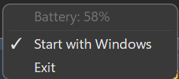

# BatterMouse

<p align="center">
  A lightweight Windows system tray app that monitors the battery level of your <strong>Keychron M6</strong> wireless mouse.
</p>

---

## Features

- **Live battery percentage** shown directly in the system tray icon
- **Low battery alert** — Windows toast notification when battery drops to 20%
- **Charging detection** — tray icon shows a green lightning bolt while charging
- **Auto-reconnect** — recovers automatically if the dongle is unplugged and re-inserted
- **Start with Windows** — optional auto-start toggle in the context menu
- **Minimal footprint** — single `.exe`, no installer, no admin rights required

---

## GUI

The app lives entirely in the system tray. The icon shows the current battery percentage, or a green lightning bolt while the battery level is loading.

<p align="center">
  
  &nbsp;&nbsp;&nbsp;
  
</p>

Right-clicking opens a Windows 11–styled context menu:

<p align="center">
  
</p>

| Element | Description |
|---|---|
| Battery label | Current percentage (read-only display) |
| Start with Windows | Toggle auto-start at login |
| Exit | Quit the application |

Double-clicking the tray icon launches the Keychron Launcher.

---

## Requirements

- Windows 10 (build 19041) or Windows 11, x64
- Keychron M6 wireless mouse with the **Keychron Link 2.4 GHz dongle**
  - USB VID `0x3434`, PID `0xD030` (wireless) / `0xD037` (wired/charging)

---

## Installation

1. Download the latest `BatterMouse.exe` from [Releases](../../releases).
2. Run it — no installation needed.
3. Optionally enable **Start with Windows** from the tray menu.

---

## How It Works

BatterMouse communicates with the Keychron dongle over **HID** using [HidSharp](https://github.com/IntergatedCircuits/HidSharp). It listens on two interfaces:

- **mi_03** (FF60 vendor interface) — detects when the wireless link is established
- **mi_01** (Battery System TLC, usage `0x008C`) — receives periodic battery reports

Battery data is read from HID report `0x54`/`0xE2`: byte offset 5 carries the percentage, byte offset 6 indicates charging. A watchdog timer resets the charging state if no status reports arrive within 15 seconds (i.e. cable unplugged).

The last known battery level is cached in `%APPDATA%\BatterMouse\battery.cache` and restored on next launch.

---

## Building from Source

```
dotnet build BatterMouse.sln
```

To publish a self-contained single-file executable:

```
dotnet publish BatterMouse/BatterMouse.csproj -c Release -r win-x64
```

### Running Tests

```
dotnet test BatterMouse.Tests/BatterMouse.Tests.csproj
```

---

## License

MIT
